# CAPÍTULO III – METODOLOGIA DE DESENVOLVIMENTO

## 3.1 Introdução

O presente capítulo descreve a metodologia adoptada para o desenvolvimento do Sistema de Gestão de Dívidas da Ncangaza Multiservices Lda., abrangendo todas as fases do ciclo de vida do software: planeamento, análise de requisitos, design, implementação, testes e manutenção. São apresentadas, igualmente, a proposta de arquitectura do sistema, o desenho da base de dados, o dicionário de dados e os diagramas que modelam o comportamento e a estrutura do sistema.

---

## 3.2 Metodologia de Desenvolvimento de Software

### 3.2.1 Escolha da Metodologia

Para o desenvolvimento do Sistema de Gestão de Dívidas, foi adoptada a **metodologia incremental**, combinada com práticas de **desenvolvimento ágil**. Esta abordagem foi escolhida porque:

- Permite entregas parciais e funcionais ao longo do projecto;
- Facilita a incorporação de *feedback* do utilizador em cada iteração;
- Reduz o risco de falhas ao validar funcionalidades progressivamente;
- É adequada a projectos de pequena e média escala com requisitos que podem evoluir.

### 3.2.2 Fases da Metodologia

A metodologia adoptada é composta por seis fases, descritas a seguir.

#### 3.2.2.1 Fase 1 – Planeamento

Nesta fase, foram definidos os objectivos do projecto, o escopo do sistema e os recursos necessários. As actividades realizadas incluem:

- **Definição do problema**: Identificação das dificuldades da Ncangaza Multiservices no controlo manual de dívidas de clientes;
- **Definição dos objectivos**: Automatizar o registo, acompanhamento e notificação de dívidas;
- **Levantamento de recursos**: Identificação das tecnologias, ferramentas e competências necessárias;
- **Cronograma**: Elaboração de um plano de trabalho com marcos temporais para cada fase.

**Como garante o sucesso**: O planeamento assegura que o projecto tenha direcção clara, evitando retrabalho e desperdício de recursos.

#### 3.2.2.2 Fase 2 – Análise de Requisitos

A análise de requisitos consistiu na recolha e documentação das necessidades do sistema, classificadas em requisitos funcionais e não-funcionais.

**Requisitos Funcionais:**

1. O sistema deve permitir o registo, edição e eliminação de clientes;
2. O sistema deve permitir o registo, edição e eliminação de dívidas associadas a clientes;
3. O sistema deve actualizar automaticamente o estado das dívidas (pendente, vencida, paga);
4. O sistema deve enviar notificações automáticas por e-mail e *in-app* quando uma dívida estiver próxima do vencimento ou vencida;
5. O sistema deve gerar relatórios em PDF com dados de clientes e dívidas;
6. O sistema deve apresentar um painel de controlo (*dashboard*) com indicadores financeiros;
7. O sistema deve permitir a gestão de utilizadores com controlo de acesso baseado em papéis (administrador e utilizador);
8. O sistema deve manter um histórico de actividades e acessos.

**Requisitos Não-Funcionais:**

1. **Desempenho**: O sistema deve responder em menos de 2 segundos para operações comuns;
2. **Segurança**: Implementação de autenticação JWT, políticas RLS e encriptação de palavras-passe;
3. **Usabilidade**: Interface intuitiva e responsiva, compatível com dispositivos móveis e *desktop*;
4. **Disponibilidade**: O sistema deve estar disponível 99,5% do tempo;
5. **Manutenibilidade**: Código modular, documentado e com separação clara de responsabilidades.

**Como garante o sucesso**: A análise detalhada de requisitos assegura que o sistema desenvolvido atende às necessidades reais da organização, evitando lacunas funcionais.

#### 3.2.2.3 Fase 3 – Design do Sistema

O design do sistema envolveu a definição da arquitectura, a modelação da base de dados e a criação dos diagramas UML. Esta fase é detalhada nas secções 3.3, 3.4 e 3.5 deste capítulo.

**Como garante o sucesso**: O design cuidadoso garante que a implementação siga uma estrutura coerente, reduzindo erros de integração e facilitando a manutenção futura.

#### 3.2.2.4 Fase 4 – Implementação

A implementação seguiu uma abordagem incremental, dividida nos seguintes módulos:

| Incremento | Módulo | Funcionalidades |
|------------|--------|-----------------|
| 1.º | Autenticação e Perfis | Login, registo, gestão de sessões, perfis de utilizador |
| 2.º | Gestão de Clientes | CRUD de clientes, pesquisa, filtros, exportação |
| 3.º | Gestão de Dívidas | CRUD de dívidas, actualização automática de estados |
| 4.º | Notificações | Notificações *in-app*, por e-mail, templates configuráveis |
| 5.º | Dashboard e Relatórios | Painel de controlo, gráficos, geração de PDF |
| 6.º | Administração | Gestão de utilizadores, papéis, configurações do sistema |

**Como garante o sucesso**: A implementação incremental permite validar cada módulo antes de avançar, reduzindo a acumulação de defeitos.

#### 3.2.2.5 Fase 5 – Testes

Os testes foram realizados em paralelo com cada incremento, utilizando as seguintes técnicas:

- **Testes manuais de funcionalidade**: Verificação de cada caso de uso conforme os requisitos;
- **Testes de integração**: Validação da comunicação entre *front-end*, *back-end* e base de dados;
- **Testes de usabilidade**: Avaliação da experiência do utilizador com base em cenários reais;
- **Testes de segurança**: Verificação das políticas RLS, autenticação e autorização.

**Como garante o sucesso**: Os testes contínuos garantem a qualidade do software e a conformidade com os requisitos especificados.

#### 3.2.2.6 Fase 6 – Manutenção

Após a implantação, o sistema entra em fase de manutenção, que inclui:

- Correcção de defeitos reportados pelos utilizadores;
- Actualizações de segurança e dependências;
- Implementação de melhorias solicitadas;
- Monitorização do desempenho e disponibilidade.

**Como garante o sucesso**: A manutenção assegura a longevidade e a relevância do sistema ao longo do tempo.

### 3.2.3 Boas Práticas Adoptadas

As seguintes boas práticas foram adoptadas durante o desenvolvimento:

- **Controlo de versão** com Git e GitHub para rastreabilidade de alterações;
- **Componentes reutilizáveis** (*Component-Based Architecture*) para reduzir duplicação de código;
- **Separação de responsabilidades** entre camadas (*front-end*, *back-end*, base de dados);
- **Segurança por defeito** (*Security by Default*) com políticas RLS activas em todas as tabelas;
- **Validação dupla** de dados: no *front-end* (Zod) e no *back-end* (PostgreSQL *constraints*);
- **Normalização da base de dados** até à 3.ª Forma Normal (3FN) para eliminar redundâncias;
- ***Responsive Design*** para garantir acessibilidade em diferentes dispositivos;
- **Documentação contínua** de código e decisões de design.

---

## 3.3 Proposta de Arquitectura do Sistema

### 3.3.1 Visão Geral da Arquitectura

O sistema adopta uma arquitectura **cliente-servidor de três camadas**, com um *front-end* baseado em componentes React, um *back-end serverless* fornecido pela plataforma Supabase e uma base de dados relacional PostgreSQL. A comunicação entre as camadas é feita via API REST e WebSockets para actualizações em tempo real.

### 3.3.2 Camadas do Sistema

A tabela seguinte apresenta as três camadas e as respectivas tecnologias:

| Camada | Tecnologias | Responsabilidade |
|--------|------------|------------------|
| **Front-end** (Camada de Apresentação) | React 18, TypeScript, TailwindCSS, shadcn/ui, Recharts | Interface do utilizador, validação de formulários, navegação, visualização de dados |
| **Back-end** (Camada de Lógica de Negócio) | Supabase Edge Functions (Deno), Supabase Auth, Supabase Realtime | Autenticação, autorização, funções serverless, notificações por e-mail, lógica de negócio |
| **Base de Dados** (Camada de Dados) | PostgreSQL 15, Supabase Storage | Armazenamento persistente, políticas RLS, triggers, funções PL/pgSQL |

### 3.3.3 Diagrama de Arquitectura do Sistema

O diagrama seguinte ilustra a interacção entre as camadas do sistema. O navegador web (*browser*) comunica com o *front-end* React, que por sua vez interage com os serviços Supabase (autenticação, API REST, funções *edge* e *realtime*). Todos os serviços acedem à base de dados PostgreSQL central.

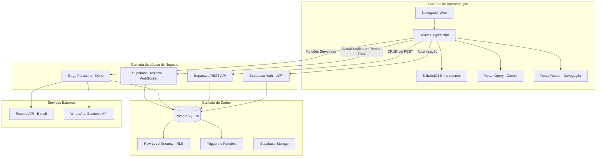

### 3.3.4 Interacção entre Componentes

A interacção entre os componentes do sistema segue o seguinte fluxo:

1. **Autenticação**: O utilizador submete as credenciais no *front-end*. O React envia a solicitação ao Supabase Auth, que valida as credenciais contra a tabela `auth.users` do PostgreSQL e devolve um token JWT;
2. **Operações CRUD**: Cada pedido do *front-end* inclui o token JWT no cabeçalho `Authorization`. O Supabase REST API recebe o pedido, aplica as políticas RLS da tabela-alvo e executa a operação na base de dados;
3. **Funções Serverless**: Operações complexas (criação de utilizadores, envio de e-mails, verificação de dívidas) são processadas por Edge Functions escritas em Deno/TypeScript, que acedem à base de dados com a chave de serviço;
4. **Tempo Real**: O Supabase Realtime escuta alterações na base de dados via WebSocket e propaga-as automaticamente ao *front-end*, actualizando a interface sem necessidade de *refresh*;
5. **Notificações**: Quando uma dívida é marcada como vencida (via *trigger* na base de dados), é invocada uma Edge Function que envia e-mails através da API Resend e cria registos na tabela `notificacoes`.

### 3.3.5 Justificação das Tecnologias

| Tecnologia | Justificação |
|-----------|--------------|
| **React** | Biblioteca de *front-end* mais utilizada, com vasta comunidade e ecossistema de componentes |
| **TypeScript** | Tipagem estática que reduz erros em tempo de execução e melhora a manutenibilidade |
| **TailwindCSS** | Framework CSS utilitário que acelera o desenvolvimento de interfaces responsivas |
| **Supabase** | Alternativa *open-source* ao Firebase, com PostgreSQL, autenticação e funções serverless integradas |
| **PostgreSQL** | SGBD relacional robusto, com suporte a RLS, triggers e funções PL/pgSQL |
| **Deno** | Runtime seguro para Edge Functions, com suporte nativo a TypeScript |

---

## 3.4 Desenho da Base de Dados

### 3.4.1 Abordagem de Modelação

A base de dados foi modelada seguindo o processo de normalização até à **Terceira Forma Normal (3FN)**, garantindo a eliminação de redundâncias, dependências parciais e dependências transitivas. O processo seguiu as seguintes etapas:

1. **Identificação das entidades**: Clientes, Dívidas, Notificações, Perfis de Utilizador, Papéis de Utilizador, Histórico de *Login*, Actividades do Utilizador e Templates de Notificação;
2. **Definição dos atributos**: Para cada entidade, foram identificados os atributos necessários e os respectivos tipos de dados;
3. **Estabelecimento dos relacionamentos**: Definição das chaves primárias e estrangeiras que ligam as entidades;
4. **Normalização**: Verificação e aplicação das formas normais para garantir a integridade dos dados.

### 3.4.2 Dicionário de Base de Dados

A seguir, apresenta-se o dicionário de dados com a descrição de cada tabela, os respectivos campos, tipos de dados e relacionamentos.

#### Tabela 3.1 – Tabela `clientes`

Armazena os dados dos clientes da Ncangaza Multiservices.

| Campo | Tipo de Dado | Nulo | Valor Padrão | Descrição |
|-------|-------------|------|-------------|-----------|
| `id` | UUID | Não | `gen_random_uuid()` | Identificador único do cliente (chave primária) |
| `nome` | TEXT | Não | — | Nome completo do cliente |
| `nuit` | TEXT | Sim | — | Número Único de Identificação Tributária |
| `email` | TEXT | Sim | — | Endereço de e-mail do cliente |
| `telefone` | TEXT | Sim | — | Número de telefone do cliente |
| `endereco` | TEXT | Sim | — | Endereço físico do cliente |
| `ativo` | BOOLEAN | Não | `true` | Indica se o cliente está activo no sistema |
| `data_registro` | TIMESTAMPTZ | Não | `now()` | Data e hora do registo do cliente |
| `created_at` | TIMESTAMPTZ | Não | `now()` | Data e hora de criação do registo |
| `updated_at` | TIMESTAMPTZ | Não | `now()` | Data e hora da última actualização |

**Relacionamentos**: Um cliente pode ter zero ou mais dívidas (1:N com `dividas`). Um cliente pode ter zero ou mais notificações (1:N com `notificacoes`).

#### Tabela 3.2 – Tabela `dividas`

Armazena as dívidas dos clientes, incluindo valores, datas e estado de pagamento.

| Campo | Tipo de Dado | Nulo | Valor Padrão | Descrição |
|-------|-------------|------|-------------|-----------|
| `id` | UUID | Não | `gen_random_uuid()` | Identificador único da dívida (chave primária) |
| `cliente_id` | UUID | Não | — | Referência ao cliente (chave estrangeira → `clientes.id`) |
| `valor` | NUMERIC | Não | — | Valor monetário da dívida em Meticais (MTn) |
| `descricao` | TEXT | Não | — | Descrição do produto ou serviço associado à dívida |
| `data_vencimento` | DATE | Não | — | Data limite para pagamento |
| `data_pagamento` | TIMESTAMPTZ | Sim | — | Data efectiva do pagamento (preenchida quando a dívida é paga) |
| `status` | TEXT | Não | `'pendente'` | Estado da dívida: `pendente`, `vencida` ou `paga` |
| `data_criacao` | TIMESTAMPTZ | Não | `now()` | Data de criação da dívida |
| `created_at` | TIMESTAMPTZ | Não | `now()` | Data de criação do registo |
| `updated_at` | TIMESTAMPTZ | Não | `now()` | Data da última actualização |

**Relacionamentos**: Cada dívida pertence a exactamente um cliente (N:1 com `clientes`). Uma dívida pode ter zero ou mais notificações (1:N com `notificacoes`).

#### Tabela 3.3 – Tabela `notificacoes`

Armazena o histórico de notificações enviadas aos clientes sobre as suas dívidas.

| Campo | Tipo de Dado | Nulo | Valor Padrão | Descrição |
|-------|-------------|------|-------------|-----------|
| `id` | UUID | Não | `gen_random_uuid()` | Identificador único da notificação (chave primária) |
| `divida_id` | UUID | Sim | — | Referência à dívida associada (chave estrangeira → `dividas.id`) |
| `cliente_id` | UUID | Sim | — | Referência ao cliente (chave estrangeira → `clientes.id`) |
| `tipo` | TEXT | Não | — | Tipo de notificação: `email`, `sms`, `whatsapp`, `in_app` |
| `status` | TEXT | Não | `'pendente'` | Estado da notificação: `pendente`, `enviada`, `falha` |
| `mensagem` | TEXT | Sim | — | Conteúdo da mensagem enviada |
| `data_agendamento` | TIMESTAMPTZ | Não | — | Data agendada para envio da notificação |
| `data_envio` | TIMESTAMPTZ | Sim | — | Data efectiva do envio |
| `lida` | BOOLEAN | Sim | `false` | Indica se a notificação foi lida pelo destinatário |
| `erro` | TEXT | Sim | — | Mensagem de erro caso o envio falhe |
| `created_at` | TIMESTAMPTZ | Não | `now()` | Data de criação do registo |

**Relacionamentos**: Cada notificação pode estar associada a uma dívida (N:1 com `dividas`) e a um cliente (N:1 com `clientes`).

#### Tabela 3.4 – Tabela `profiles`

Armazena os dados do perfil de cada utilizador do sistema.

| Campo | Tipo de Dado | Nulo | Valor Padrão | Descrição |
|-------|-------------|------|-------------|-----------|
| `id` | UUID | Não | `gen_random_uuid()` | Identificador único do perfil (chave primária) |
| `user_id` | UUID | Não | — | Referência ao utilizador na tabela `auth.users` |
| `full_name` | TEXT | Não | — | Nome completo do utilizador |
| `avatar_url` | TEXT | Sim | — | URL da foto de perfil |
| `telefone` | TEXT | Sim | — | Número de telefone do utilizador |
| `cargo` | TEXT | Sim | — | Cargo do utilizador na empresa |
| `departamento` | TEXT | Sim | — | Departamento do utilizador |
| `bio` | TEXT | Sim | — | Biografia ou descrição do utilizador |
| `active` | BOOLEAN | Não | `true` | Indica se o utilizador está activo |
| `email_notifications` | BOOLEAN | Sim | `true` | Preferência de notificações por e-mail |
| `sms_notifications` | BOOLEAN | Sim | `false` | Preferência de notificações por SMS |
| `whatsapp_notifications` | BOOLEAN | Sim | `true` | Preferência de notificações por WhatsApp |
| `created_by` | UUID | Sim | — | Referência ao utilizador que criou o perfil |
| `created_at` | TIMESTAMPTZ | Não | `now()` | Data de criação |
| `updated_at` | TIMESTAMPTZ | Não | `now()` | Data da última actualização |

**Relacionamentos**: Cada perfil está associado a exactamente um utilizador do sistema.

#### Tabela 3.5 – Tabela `user_roles`

Armazena os papéis (funções) atribuídos a cada utilizador. Os papéis são armazenados numa tabela separada para prevenir ataques de escalamento de privilégios.

| Campo | Tipo de Dado | Nulo | Valor Padrão | Descrição |
|-------|-------------|------|-------------|-----------|
| `id` | UUID | Não | `gen_random_uuid()` | Identificador único (chave primária) |
| `user_id` | UUID | Não | — | Referência ao utilizador (`auth.users.id`) |
| `role` | app_role (ENUM) | Não | — | Papel do utilizador: `admin` ou `user` |
| `created_at` | TIMESTAMPTZ | Sim | `now()` | Data de criação |

**Valores do ENUM `app_role`**: `admin`, `user`.

**Relacionamentos**: Cada registo associa um utilizador a um papel. A combinação (`user_id`, `role`) é única.

#### Tabela 3.6 – Tabela `login_history`

Armazena o histórico de acessos ao sistema para fins de auditoria.

| Campo | Tipo de Dado | Nulo | Valor Padrão | Descrição |
|-------|-------------|------|-------------|-----------|
| `id` | UUID | Não | `gen_random_uuid()` | Identificador único (chave primária) |
| `user_id` | UUID | Não | — | Referência ao utilizador |
| `login_at` | TIMESTAMPTZ | Não | `now()` | Data e hora do acesso |
| `ip_address` | TEXT | Sim | — | Endereço IP do acesso |
| `user_agent` | TEXT | Sim | — | Informação do navegador utilizado |
| `device_info` | TEXT | Sim | — | Informação do dispositivo |
| `location` | TEXT | Sim | — | Localização geográfica aproximada |

#### Tabela 3.7 – Tabela `user_activities`

Regista as actividades realizadas pelos utilizadores no sistema.

| Campo | Tipo de Dado | Nulo | Valor Padrão | Descrição |
|-------|-------------|------|-------------|-----------|
| `id` | UUID | Não | `gen_random_uuid()` | Identificador único (chave primária) |
| `user_id` | UUID | Não | — | Referência ao utilizador |
| `action_type` | TEXT | Não | — | Tipo de acção realizada |
| `description` | TEXT | Não | — | Descrição detalhada da acção |
| `metadata` | JSONB | Sim | — | Dados adicionais em formato JSON |
| `created_at` | TIMESTAMPTZ | Não | `now()` | Data e hora da acção |

#### Tabela 3.8 – Tabela `notification_templates`

Armazena os modelos (*templates*) de notificações configuráveis pelo administrador.

| Campo | Tipo de Dado | Nulo | Valor Padrão | Descrição |
|-------|-------------|------|-------------|-----------|
| `id` | UUID | Não | `gen_random_uuid()` | Identificador único (chave primária) |
| `name` | TEXT | Não | — | Nome do template |
| `type` | TEXT | Não | — | Tipo: `email`, `sms`, `whatsapp`, `in_app` |
| `subject` | TEXT | Não | — | Assunto da notificação |
| `body` | TEXT | Não | — | Corpo da mensagem |
| `is_default` | BOOLEAN | Sim | `false` | Indica se é o template padrão para o tipo |
| `created_at` | TIMESTAMPTZ | Não | `now()` | Data de criação |
| `updated_at` | TIMESTAMPTZ | Não | `now()` | Data da última actualização |

---

## 3.5 Diagramas do Sistema

### 3.5.1 Diagrama de Entidade-Relacionamento (DER)

#### O que é

O Diagrama de Entidade-Relacionamento (DER) é uma representação gráfica da estrutura lógica da base de dados. Ele mostra as entidades (tabelas), os seus atributos (colunas) e os relacionamentos entre elas, incluindo a cardinalidade (1:1, 1:N, N:M).

#### O que representa neste projecto

No contexto do Sistema de Gestão de Dívidas, o DER representa a forma como os dados são organizados e relacionados: clientes possuem dívidas, dívidas geram notificações, utilizadores possuem perfis e papéis, e todas as acções são registadas para auditoria.

#### Lógica passo a passo

1. A entidade central é `clientes`, que armazena os dados dos clientes da empresa;
2. Cada cliente pode ter múltiplas `dividas`, estabelecendo uma relação 1:N;
3. Cada dívida pode gerar múltiplas `notificacoes`, formando outra relação 1:N;
4. Os clientes também podem receber notificações directas (1:N);
5. A autenticação é gerida pela tabela `auth.users` do Supabase, que se relaciona com `profiles` (1:1) e `user_roles` (1:N);
6. O `login_history` e `user_activities` registam as acções dos utilizadores para auditoria;
7. Os `notification_templates` são independentes, servindo como modelos para as notificações.

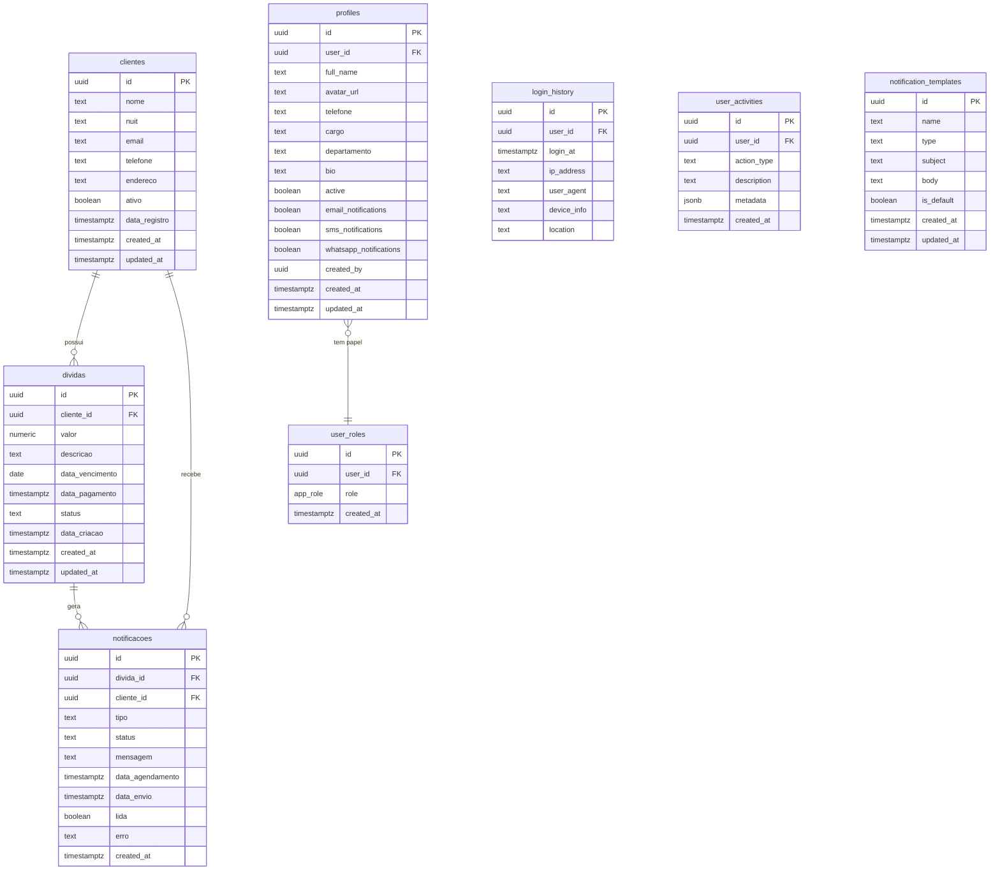

---

### 3.5.2 Diagrama de Casos de Uso

#### O que é

O Diagrama de Casos de Uso é um diagrama UML que representa as funcionalidades do sistema do ponto de vista dos actores (utilizadores). Ele identifica quem interage com o sistema e quais acções cada actor pode realizar.

#### O que representa neste projecto

Neste projecto, existem dois actores principais: o **Administrador** (com acesso total) e o **Utilizador** (com acesso restrito). O sistema em si actua como um actor secundário ao executar tarefas automáticas (actualização de estados, envio de notificações).

#### Lógica passo a passo

1. O **Utilizador** pode autenticar-se, visualizar o *dashboard*, gerir clientes e dívidas, e gerar relatórios;
2. O **Administrador** herda todas as permissões do Utilizador e pode, adicionalmente, gerir utilizadores, configurar notificações e aceder a funcionalidades administrativas;
3. O **Sistema** executa automaticamente tarefas como actualização de estados de dívidas e envio de notificações.

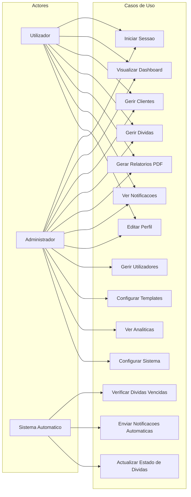

---

### 3.5.3 Diagrama de Classes

#### O que é

O Diagrama de Classes é um diagrama UML que representa a estrutura estática do sistema, mostrando as classes, os seus atributos, métodos e os relacionamentos entre elas.

#### O que representa neste projecto

No contexto de uma aplicação React com TypeScript, as "classes" correspondem às interfaces de dados, aos *hooks* personalizados e aos componentes principais que compõem o sistema.

#### Lógica passo a passo

1. A interface `Client` define os atributos de um cliente e é gerida pelo *hook* `useClients`;
2. A interface `Debt` define os atributos de uma dívida e é gerida pelo *hook* `useDebts`;
3. O `AuthContext` gere a autenticação e fornece dados do utilizador autenticado;
4. Os componentes de interface (`Dashboard`, `ClientsTable`, `DebtsTable`) consomem os *hooks* para apresentar e manipular dados;
5. O `pdfGenerator` é responsável pela geração de relatórios em formato PDF.

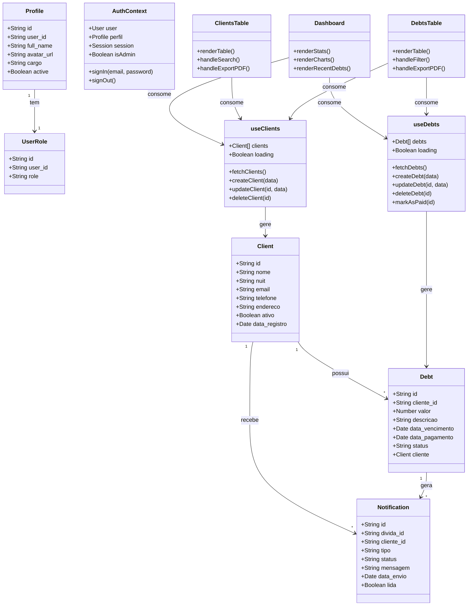

---

### 3.5.4 Diagramas de Actividade

Os diagramas de actividade representam o fluxo de trabalho (*workflow*) de processos específicos do sistema, mostrando a sequência de acções, decisões e estados.

#### 3.5.4.1 Diagrama de Actividade – Login

##### O que é
Representa o fluxo de autenticação do utilizador no sistema, desde a introdução das credenciais até ao acesso ao *dashboard*.

##### O que representa
Mostra como o sistema valida as credenciais, verifica o papel do utilizador e redireciona para a interface adequada.

##### Lógica passo a passo
1. O utilizador acede à página de *login*;
2. Introduz o e-mail e a palavra-passe;
3. O sistema envia as credenciais ao Supabase Auth;
4. Se as credenciais forem inválidas, é apresentada uma mensagem de erro;
5. Se forem válidas, o sistema obtém o perfil e o papel do utilizador;
6. O acesso é registado na tabela `login_history`;
7. O utilizador é redireccionado para o *dashboard*.

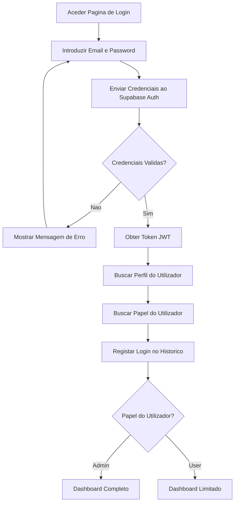

#### 3.5.4.2 Diagrama de Actividade – Administrador

##### O que é
Representa as actividades que um administrador pode realizar no sistema.

##### O que representa
Mostra o fluxo de trabalho do administrador, incluindo a gestão de utilizadores, configuração de notificações e monitorização do sistema.

##### Lógica passo a passo
1. O administrador autentica-se no sistema;
2. Acede ao *dashboard* com visão completa;
3. Pode navegar para diferentes módulos: Gestão de Utilizadores, Configurações, Relatórios;
4. Em cada módulo, pode realizar operações CRUD;
5. Todas as acções são registadas para auditoria.

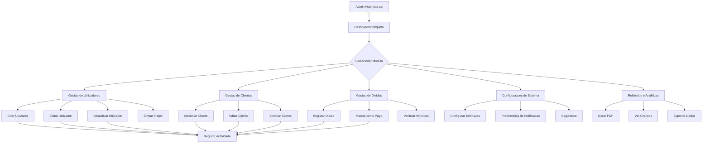

#### 3.5.4.3 Diagrama de Actividade – Sistema de Relatórios

##### O que é
Representa o fluxo de geração de relatórios no sistema, desde a selecção de parâmetros até à exportação em PDF.

##### O que representa
Mostra como o utilizador configura, gera e exporta relatórios com dados de clientes e dívidas.

##### Lógica passo a passo
1. O utilizador acede à secção de Relatórios;
2. Selecciona o tipo de relatório (clientes, dívidas, financeiro);
3. Define os filtros (período, estado, formato);
4. O sistema consulta os dados na base de dados;
5. Os dados são processados e formatados;
6. O relatório é gerado em PDF com a identidade visual da empresa;
7. O ficheiro PDF é disponibilizado para *download*.

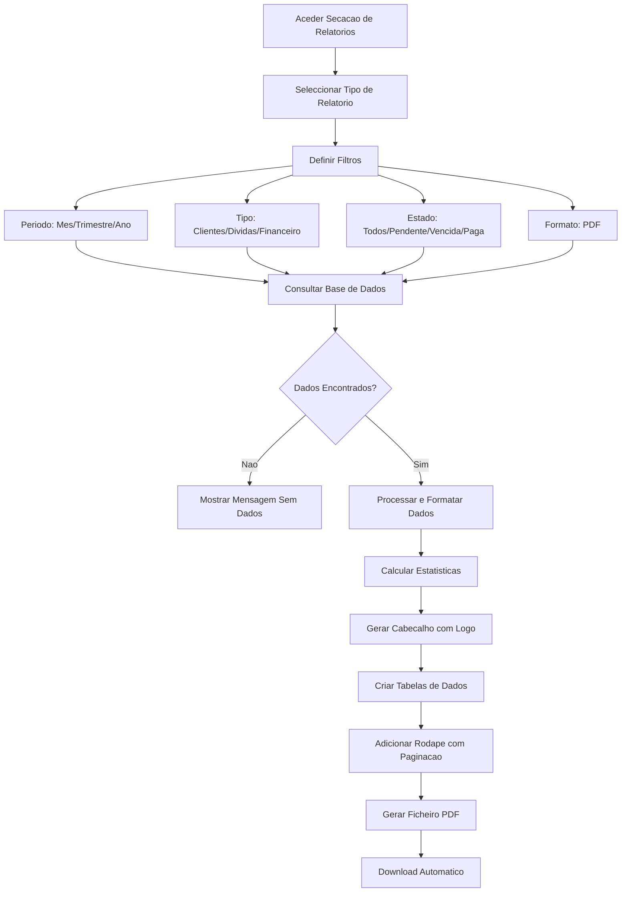

#### 3.5.4.4 Diagrama de Actividade – Utilizador

##### O que é
Representa as actividades que um utilizador comum pode realizar no sistema.

##### O que representa
Mostra o fluxo de trabalho de um utilizador com permissões limitadas.

##### Lógica passo a passo
1. O utilizador autentica-se no sistema;
2. Acede ao *dashboard* com visão limitada;
3. Pode gerir clientes e dívidas, visualizar notificações e gerar relatórios;
4. Não tem acesso à gestão de utilizadores nem às configurações avançadas.

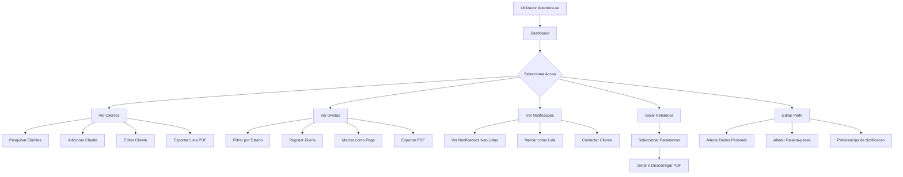

---

### 3.5.5 Diagramas de Sequência

Os diagramas de sequência representam a interacção entre os objectos do sistema ao longo do tempo, mostrando a troca de mensagens entre os componentes durante a execução de um cenário específico.

#### 3.5.5.1 Diagrama de Sequência – Login

##### O que é
Representa a sequência de interacções entre o utilizador, o *front-end*, o Supabase Auth e a base de dados durante o processo de autenticação.

##### O que representa
Mostra a ordem exacta das mensagens trocadas durante o *login*, incluindo a validação de credenciais, a obtenção do perfil e o registo do acesso.

##### Lógica passo a passo
1. O utilizador preenche o formulário de *login* no *front-end*;
2. O *front-end* chama `supabase.auth.signInWithPassword()`;
3. O Supabase Auth valida as credenciais contra `auth.users`;
4. Se válidas, devolve um token JWT e os dados da sessão;
5. O *front-end* consulta o perfil do utilizador na tabela `profiles`;
6. O *front-end* consulta o papel do utilizador na tabela `user_roles`;
7. O *front-end* invoca a Edge Function `log-login` para registar o acesso;
8. O utilizador é redireccionado para o *dashboard*.

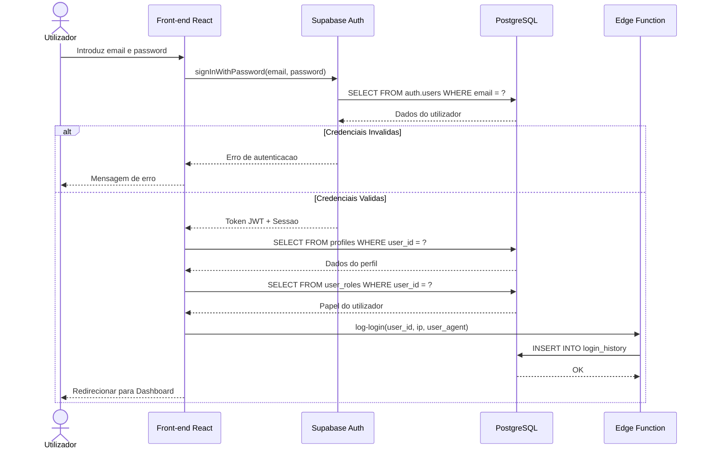

#### 3.5.5.2 Diagrama de Sequência – Registo de Dívida

##### O que é
Representa a sequência de interacções durante o registo de uma nova dívida no sistema.

##### O que representa
Mostra como os dados fluem desde o preenchimento do formulário até à persistência na base de dados e à notificação dos intervenientes.

##### Lógica passo a passo
1. O utilizador preenche o formulário de nova dívida;
2. O *front-end* valida os dados com Zod;
3. Os dados são enviados ao Supabase via API REST;
4. O PostgreSQL aplica as políticas RLS e insere o registo;
5. O *trigger* `notify_new_debt` é accionado automaticamente;
6. O Supabase Realtime notifica o *front-end* da alteração;
7. A interface é actualizada em tempo real.

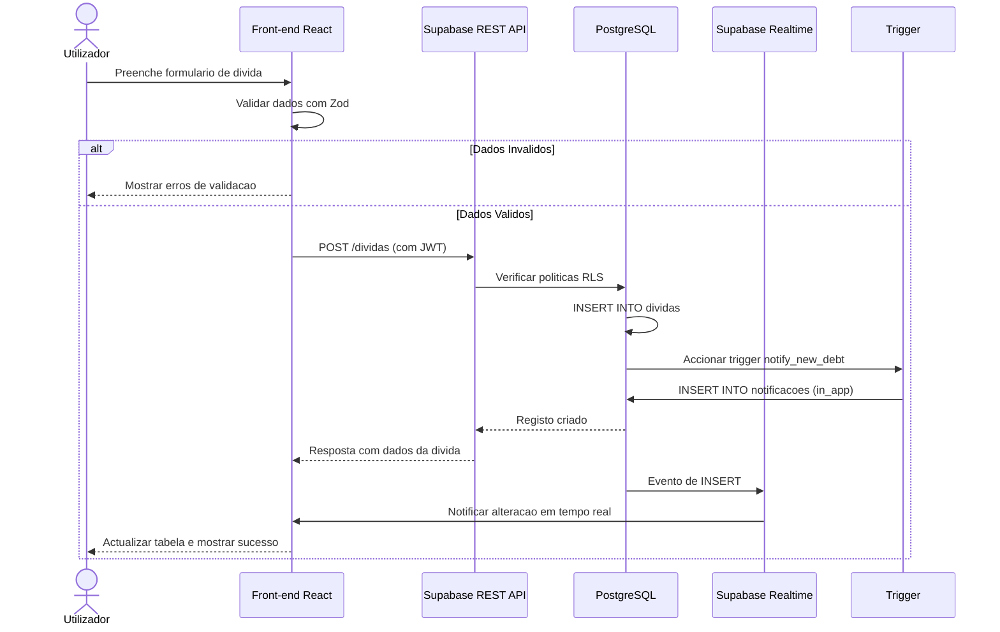

#### 3.5.5.3 Diagrama de Sequência – Envio de Notificações Automáticas

##### O que é
Representa a sequência de interacções durante a verificação e notificação automática de dívidas vencidas.

##### O que representa
Mostra como o sistema identifica dívidas vencidas, actualiza os seus estados e envia notificações por e-mail e *in-app*.

##### Lógica passo a passo
1. O administrador (ou um *cron job*) acciona a verificação de dívidas;
2. A Edge Function `check-debts` é invocada;
3. A função chama `update_debt_status()` para actualizar estados;
4. Consulta todas as dívidas com estado `vencida`;
5. Para cada dívida, obtém o *template* de notificação;
6. Envia e-mails via API Resend;
7. Cria notificações *in-app* na tabela `notificacoes`;
8. Devolve um resumo das acções realizadas.

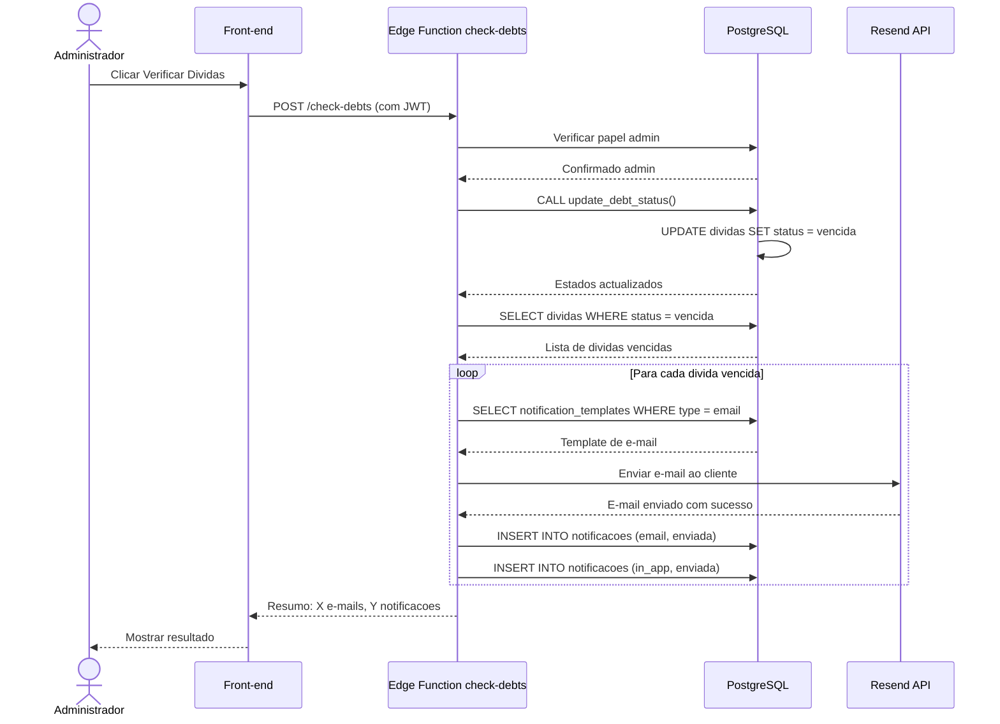

---

## 3.6 Políticas de Segurança da Base de Dados (RLS)

A segurança dos dados é garantida através de **Row Level Security (RLS)**, uma funcionalidade do PostgreSQL que restringe o acesso a linhas específicas de uma tabela com base na identidade do utilizador autenticado.

### 3.6.1 Resumo das Políticas

| Tabela | Operação | Política | Condição |
|--------|----------|----------|----------|
| `clientes` | SELECT | Utilizadores autenticados podem visualizar | `auth.role() = 'authenticated'` |
| `clientes` | INSERT | Utilizadores autenticados podem inserir | `auth.role() = 'authenticated'` |
| `clientes` | UPDATE | Utilizadores autenticados podem actualizar | `auth.role() = 'authenticated'` |
| `clientes` | DELETE | Apenas administradores podem eliminar | `has_role(auth.uid(), 'admin')` |
| `dividas` | SELECT | Utilizadores autenticados podem visualizar | `auth.role() = 'authenticated'` |
| `dividas` | INSERT | Utilizadores autenticados podem inserir | `auth.role() = 'authenticated'` |
| `dividas` | UPDATE | Utilizadores autenticados podem actualizar | `auth.role() = 'authenticated'` |
| `dividas` | DELETE | Apenas administradores podem eliminar | `has_role(auth.uid(), 'admin')` |
| `profiles` | SELECT | Utilizadores autenticados podem visualizar | `auth.role() = 'authenticated'` |
| `profiles` | INSERT/UPDATE/DELETE | Apenas administradores | `has_role(auth.uid(), 'admin')` |
| `user_roles` | SELECT | Utilizadores vêem os seus próprios papéis | `user_id = auth.uid()` |
| `user_roles` | SELECT/INSERT/UPDATE/DELETE | Administradores têm acesso total | `has_role(auth.uid(), 'admin')` |

---

## 3.7 Funções e Triggers da Base de Dados

### 3.7.1 Funções Principais

| Função | Tipo | Descrição |
|--------|------|-----------|
| `has_role(user_id, role)` | SECURITY DEFINER | Verifica se um utilizador possui um determinado papel |
| `get_user_role(user_id)` | SECURITY DEFINER | Retorna o papel de um utilizador |
| `update_debt_status()` | SECURITY DEFINER | Actualiza o estado de dívidas pendentes para vencidas |
| `check_and_notify_debts()` | SECURITY DEFINER | Verifica dívidas a vencer e envia notificações |
| `log_user_activity(type, desc, metadata)` | SECURITY DEFINER | Regista uma actividade do utilizador |
| `update_updated_at_column()` | TRIGGER | Actualiza automaticamente o campo `updated_at` |
| `notify_payment_completed()` | TRIGGER | Notifica quando um pagamento é concluído |
| `notify_debt_overdue()` | TRIGGER | Notifica quando uma dívida entra em atraso |

---

## 3.8 Formato e Estilo (Normas APA)

Para a formatação do presente capítulo na monografia, devem ser seguidas as seguintes normas:

### 3.8.1 Formatação de Texto

- **Fonte**: Times New Roman, tamanho 12pt para corpo de texto;
- **Títulos**: Negrito, tamanho 14pt (nível 1) e 12pt (nível 2 e seguintes);
- **Espaçamento entre linhas**: 1,5;
- **Margens**: 2,5 cm em todos os lados;
- **Alinhamento**: Justificado;
- **Parágrafos**: Indentação de 1,27 cm na primeira linha.

### 3.8.2 Formatação de Tabelas

- Tabelas devem ser numeradas sequencialmente (Tabela 3.1, Tabela 3.2, etc.);
- O título da tabela deve aparecer acima da tabela, em itálico;
- Tabelas devem ter bordas horizontais (sem bordas verticais, segundo APA);
- Notas explicativas devem ser colocadas abaixo da tabela.

### 3.8.3 Formatação de Figuras

- Figuras (incluindo diagramas) devem ser numeradas sequencialmente (Figura 3.1, Figura 3.2, etc.);
- A legenda deve aparecer abaixo da figura;
- Diagramas devem ser suficientemente legíveis quando impressos.

### 3.8.4 Formatação de Listas

- Listas numeradas: Usar numeração arábica (1., 2., 3.);
- Listas não-numeradas: Usar marcadores (*bullet points*);
- Indentação: 1,27 cm para o primeiro nível, 2,54 cm para o segundo nível;
- Cada item de lista deve iniciar com letra minúscula (excepto nomes próprios) e terminar com ponto e vírgula, excepto o último item que termina com ponto final.

### 3.8.5 Citações e Referências

- Citações directas com menos de 40 palavras: entre aspas, no corpo do texto;
- Citações directas com 40 ou mais palavras: em bloco recuado, sem aspas;
- Referências no formato APA 7.ª edição: Autor (Ano). *Título*. Editora.
