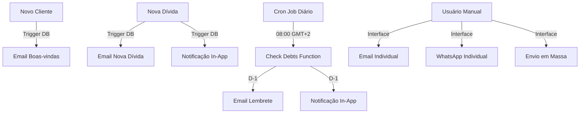

# 📧 Sistema de Notificações - Ncangaza Multiservices

## 🎯 Visão Geral

O sistema possui **3 canais de notificação** totalmente integrados e funcionais:

1. **Email** (via Resend) - Automático e profissional
2. **WhatsApp** (Click-to-Chat) - Direto e instantâneo
3. **In-App** (Tempo Real) - Dentro do sistema

---

## 1. 📧 NOTIFICAÇÕES POR EMAIL

### Automáticas (Triggers de Banco)

#### 1.1 Email de Boas-Vindas
**Quando:** Cliente é cadastrado com email
**Trigger:** `notify_new_client` na tabela `clientes`
**Template:**
```
Assunto: 🎉 Bem-vindo à Ncangaza Multiservices

Bem-vindo(a) à Ncangaza Multiservices, [NOME]!

Seu cadastro foi realizado com sucesso no nosso sistema de gestão de dívidas.

Dados cadastrados:
- Nome: [NOME]
- NUIT: [NUIT]
- Telefone: [TELEFONE]
- Email: [EMAIL]
- Endereço: [ENDEREÇO]

Em caso de dúvidas, entre em contato conosco.

Atenciosamente,
Equipe Ncangaza Multiservices
```

#### 1.2 Email de Nova Dívida
**Quando:** Dívida é criada
**Trigger:** `notify_new_debt` na tabela `dividas`
**Template:**
```
Assunto: 💰 Nova dívida registrada - Ncangaza Multiservices

Olá [CLIENTE],

Uma nova dívida foi registrada em seu nome no sistema Ncangaza Multiservices.

Detalhes da dívida:
- Descrição: [DESCRIÇÃO]
- Valor: [VALOR] MZN
- Data de vencimento: [DATA]
- Status: Pendente

Por favor, certifique-se de efetuar o pagamento até a data de vencimento.

Atenciosamente,
Equipe Ncangaza Multiservices
```

#### 1.3 Lembrete de Vencimento (D-1)
**Quando:** 1 dia antes do vencimento
**Edge Function:** `check-debts` (executada diariamente)
**Template:**
```
Assunto: ⚠️ LEMBRETE: Dívida vence amanhã - Ncangaza Multiservices

Olá [CLIENTE],

⚠️ LEMBRETE: Sua dívida vence amanhã!

Detalhes da dívida:
- Descrição: [DESCRIÇÃO]
- Valor: [VALOR] MZN
- Data de vencimento: [DATA] (AMANHÃ)

Por favor, efetue o pagamento o quanto antes para evitar multas ou juros.

Atenciosamente,
Equipe Ncangaza Multiservices
```

### Manuais (Via Interface)

#### 1.4 Envio Manual Individual
**Onde:** Página de Notificações > Aba "Notificações"
**Como:**
1. Selecione a dívida
2. Personalize a mensagem (opcional)
3. Clique em "Enviar Email"

#### 1.5 Envio em Massa
**Onde:** Página de Notificações > Aba "Notificações"
**Como:**
1. Configure filtros (dias de antecedência)
2. Ative "Notificações por Email"
3. Clique em "Enviar Notificações em Massa"

---

## 2. 💬 NOTIFICAÇÕES WHATSAPP

### Click-to-Chat (Sem necessidade de API)

**Como funciona:**
1. Sistema gera link do WhatsApp com mensagem pré-preenchida
2. Abre WhatsApp Web ou App automaticamente
3. Usuário só precisa clicar em "Enviar"
4. Sistema registra o envio no banco

**Formato do número:** +258 XX XXX XXXX

### Envio Individual
**Onde:** Página de Notificações > Aba "Notificações"
**Como:**
1. Localize a dívida
2. Clique no botão WhatsApp
3. Janela do WhatsApp abre automaticamente
4. Clique em "Enviar" no WhatsApp

### Envio em Massa
**Onde:** Página de Notificações > Aba "Notificações"
**Como:**
1. Configure filtros
2. Ative "WhatsApp"
3. Clique em "Enviar Notificações em Massa"
4. Cada cliente abre em nova janela WhatsApp

**Template WhatsApp:**
```
Olá [CLIENTE],

Gostaríamos de informar que a dívida referente a "[DESCRIÇÃO]" no valor de [VALOR] MZN venceu em [DATA].

Por favor, entre em contacto connosco o mais breve possível para regularizar a situação.

Atenciosamente,
Equipe Ncangaza Multiservices
```

---

## 3. 🔔 NOTIFICAÇÕES IN-APP

### Como funciona
- **Tempo Real:** Usa Supabase Realtime
- **Localização:** Ícone de sino no header
- **Badge:** Contador animado de não lidas
- **Persistência:** Salvas no banco de dados

### Tipos de Notificação
1. **Dívida Vencida** (Tipo: warning)
2. **Nova Dívida** (Tipo: info)
3. **Lembrete** (Tipo: warning)
4. **Sistema** (Tipo: info)

### Interface
**Badge no Header:**
- Ícone de sino com animação pulse
- Contador vermelho animado (bounce)
- Abre popover ao clicar

**Popover de Notificações:**
- Lista de até 10 notificações mais recentes
- Botão "Marcar todas como lidas"
- Ações: Marcar individual / Remover
- Timestamp relativo (ex: "5m atrás")

---

## 4. ⚙️ CONFIGURAÇÕES

### Página de Configurações
**Onde:** Notificações > Aba "Configurações"

**Opções disponíveis:**

#### Email
- Ativar/Desativar notificações por email
- Email de contato da empresa

#### WhatsApp
- Ativar/Desativar WhatsApp
- Telefone da empresa (formato +258)

#### In-App
- Sempre ativas (não podem ser desativadas)
- Tipos de notificação recebidas

#### Avançado
- Dias de antecedência para lembrete (padrão: 3)
- Horário de envio automático (padrão: 08:00)
- Backup automático

---

## 5. 📊 MONITORAMENTO

### Estatísticas Disponíveis
**Onde:** Notificações > Aba "Notificações"

**Cards de Resumo:**
1. **Notificações Hoje**
   - Quantidade enviada hoje
   - Atualiza em tempo real

2. **Taxa de Sucesso**
   - Percentual de entregas bem-sucedidas
   - Últimas 100 notificações

3. **Próximos Envios**
   - Quantidade de dívidas pendentes
   - Baseado nos filtros configurados

### Histórico Completo
**Onde:** Notificações > Aba "Notificações" > Seção "Histórico"

**Informações:**
- Data/hora do envio
- Cliente e dívida
- Tipo (email/WhatsApp/in-app)
- Status (enviada/erro)
- Mensagem de erro (se houver)

---

## 6. 🔄 FLUXO AUTOMÁTICO

### Diagrama de Funcionamento



---

## 7. 🛠️ TROUBLESHOOTING

### Emails não estão sendo enviados
✅ **Verificar:**
1. Domínio validado no Resend: https://resend.com/domains
2. API Key `RESEND_API_KEY` configurada
3. Edge function `send-email` deployada
4. Logs da edge function (Supabase Dashboard)

**Como testar:**
```bash
# Via interface:
Notificações > Aba "Notificações" > Teste de Email
```

### WhatsApp não abre
✅ **Verificar:**
1. Número do cliente está no formato correto (+258...)
2. WhatsApp instalado/acessível
3. Popup não bloqueado pelo navegador

### Notificações In-App não aparecem
✅ **Verificar:**
1. Tabela `notificacoes` tem registros com `tipo = 'in_app'`
2. Supabase Realtime está ativo
3. Console do navegador para erros
4. Hook `useNotifications` está sendo usado

---

## 8. 📋 BANCO DE DADOS

### Tabela: `notificacoes`
```sql
CREATE TABLE public.notificacoes (
  id UUID PRIMARY KEY DEFAULT gen_random_uuid(),
  divida_id UUID REFERENCES dividas(id),
  tipo TEXT NOT NULL, -- 'email', 'whatsapp', 'in_app'
  status TEXT NOT NULL, -- 'enviada', 'erro', 'pendente'
  mensagem TEXT,
  erro TEXT,
  data_agendamento TIMESTAMPTZ,
  data_envio TIMESTAMPTZ,
  created_at TIMESTAMPTZ DEFAULT NOW()
);
```

### Triggers Ativos
1. `notify_new_client` - Email de boas-vindas
2. `notify_new_debt` - Email de nova dívida

### Functions SQL
1. `check_and_notify_debts()` - Verifica dívidas vencidas
2. `update_debt_status()` - Atualiza status das dívidas

---

## 9. 🚀 DEPLOYMENT

### Edge Functions a serem deployadas
- [x] `send-email` - Envio de emails via Resend
- [x] `check-debts` - Verificação diária automática
- [x] `log-login` - Log de atividades

### Cron Job (OBRIGATÓRIO)
```sql
-- Executar no Supabase SQL Editor
SELECT cron.schedule(
  'daily-debt-check',
  '0 6 * * *', -- 06:00 UTC = 08:00 GMT+2
  $$ 
  SELECT net.http_post(
    url := 'https://vmgrnkuhprxowcvydnvm.supabase.co/functions/v1/check-debts',
    headers := jsonb_build_object(
      'Content-Type', 'application/json',
      'Authorization', 'Bearer ' || current_setting('app.settings.service_role_key')
    )
  );
  $$
);
```

---

## 10. ✅ CHECKLIST DE ATIVAÇÃO

### Antes do Deploy
- [ ] Criar conta Resend
- [ ] Validar domínio ncangazanms.net.com
- [ ] Configurar `RESEND_API_KEY`
- [ ] Testar envio de email
- [ ] Configurar Cron Job no Supabase

### Após Deploy
- [ ] Testar email de boas-vindas (criar cliente teste)
- [ ] Testar email de nova dívida (criar dívida teste)
- [ ] Testar WhatsApp click-to-chat
- [ ] Verificar notificações in-app
- [ ] Monitorar logs por 7 dias

---

## 📞 SUPORTE

**Logs de Edge Functions:**
https://supabase.com/dashboard/project/vmgrnkuhprxowcvydnvm/functions

**Documentação Resend:**
https://resend.com/docs

**Status do Sistema:**
Verificar na página de Notificações > Aba "Notificações"
