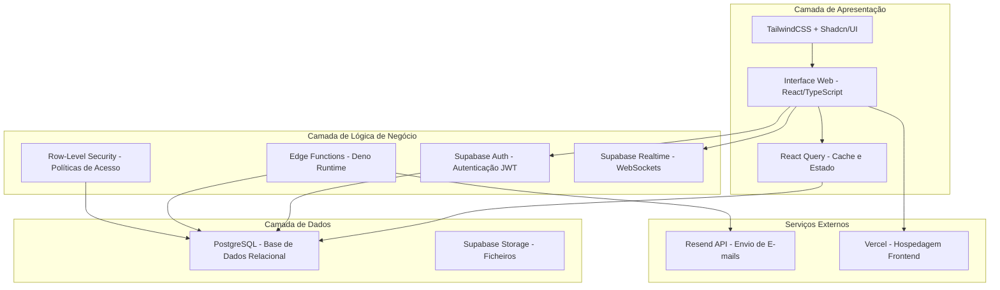
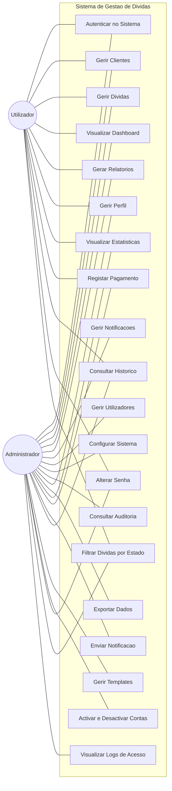
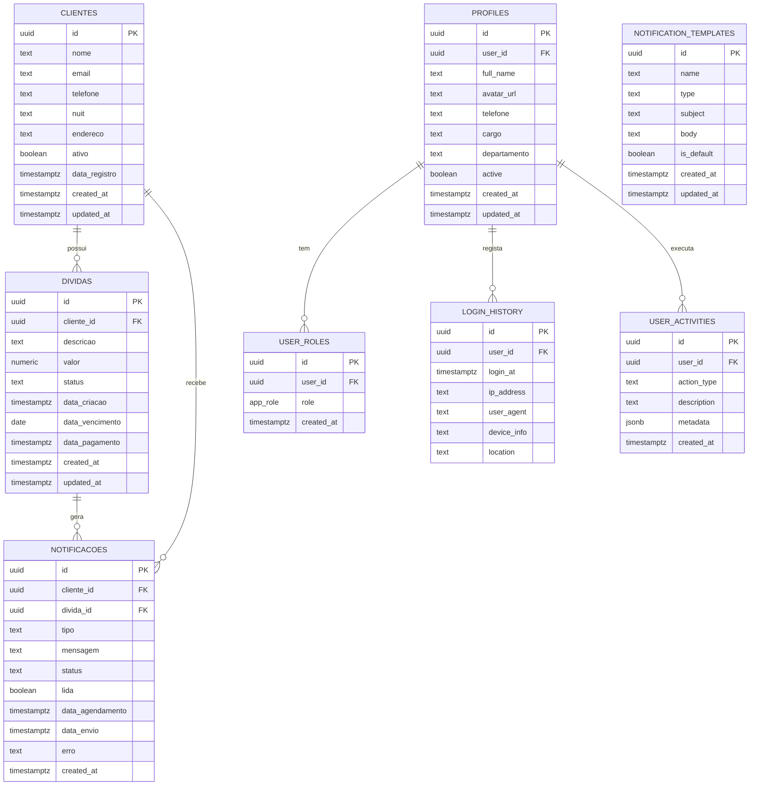
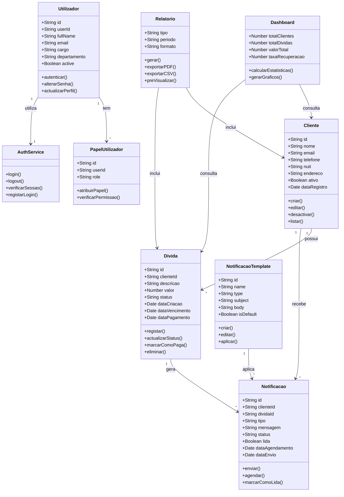
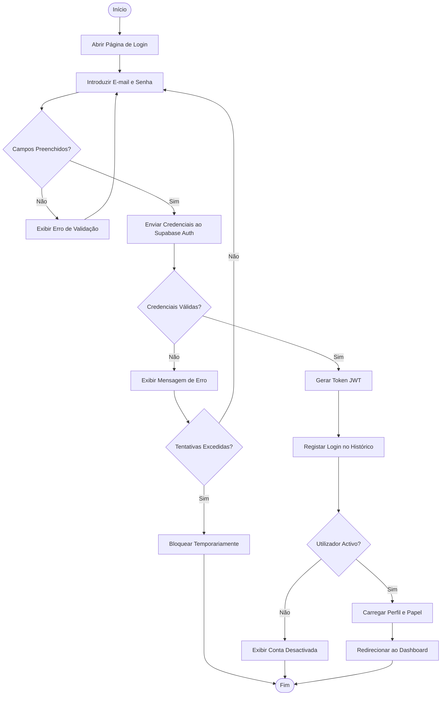
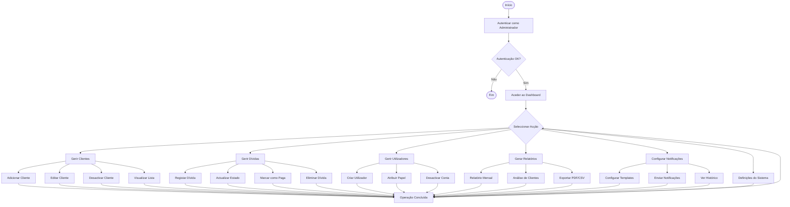
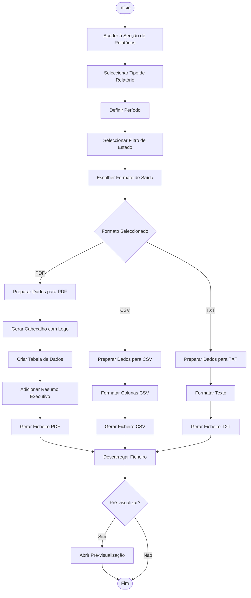
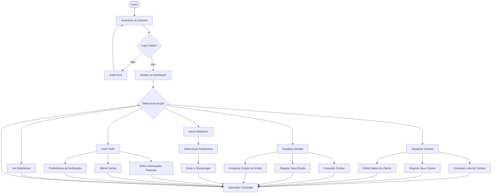
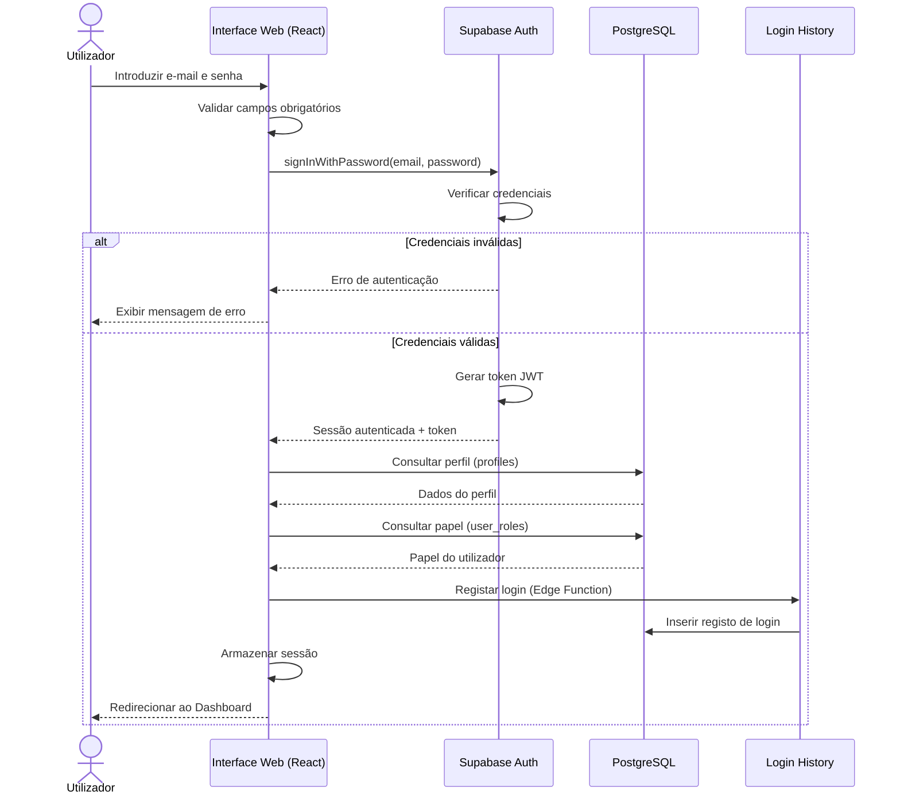
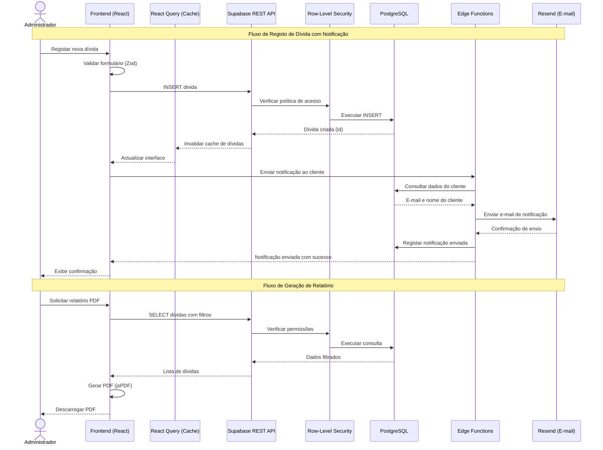

# 3. Proposta de Arquitetura e Desenho do Sistema

## 3.1 Proposta de Arquitetura do Sistema

A arquitectura do Sistema de Gestão de Dívidas da Ncangaza Multiservices foi concebida seguindo o paradigma **cliente-servidor moderno**, com separação clara de responsabilidades entre as diferentes camadas do sistema. Esta abordagem garante escalabilidade, manutenibilidade e segurança no tratamento dos dados financeiros sensíveis da empresa.

### 3.1.1 Estrutura Geral do Sistema

O sistema adopta uma arquitectura de três camadas (Three-Tier Architecture), composta por:

- **Camada de Apresentação (Frontend):** Interface web responsiva desenvolvida em React com TypeScript, responsável pela interacção directa com o utilizador.
- **Camada de Lógica de Negócio (Backend):** Implementada através de Edge Functions serverless (Deno/TypeScript) e políticas de segurança ao nível da base de dados (Row-Level Security), processando as regras de negócio do sistema.
- **Camada de Dados (Base de Dados):** PostgreSQL gerido pelo Supabase, armazenando todos os dados do sistema com integridade referencial e políticas de acesso granulares.

### 3.1.2 Diagrama de Arquitectura do Sistema

### 3.1.3 Interacção entre Componentes

A comunicação entre os componentes do sistema segue o seguinte fluxo:

1. **Utilizador → Interface Web:** O utilizador interage com a aplicação web através do navegador, utilizando componentes React responsivos.
2. **Interface Web → Supabase Auth:** As solicitações de autenticação são processadas pelo Supabase Auth, que gera tokens JWT para sessões seguras.
3. **Interface Web → PostgreSQL:** As consultas de dados são realizadas directamente via API REST do Supabase, protegidas por políticas RLS.
4. **Edge Functions → PostgreSQL:** Operações complexas como criação de utilizadores, envio de notificações e verificação automática de dívidas são processadas por funções serverless.
5. **Edge Functions → Resend API:** O envio de notificações por e-mail é realizado através da integração com o serviço Resend.
6. **Supabase Realtime → Interface Web:** Actualizações em tempo real são transmitidas via WebSockets para manter a interface sincronizada.

### 3.1.4 Tecnologias Utilizadas

| Componente | Tecnologia | Versão | Justificação |
|---|---|---|---|
| Frontend | React | 18.3.1 | Biblioteca líder para interfaces reactivas |
| Linguagem | TypeScript | 5.x | Tipagem estática para maior robustez |
| Estilização | TailwindCSS | 3.x | Framework CSS utilitário para desenvolvimento ágil |
| Componentes UI | Shadcn/UI | Latest | Componentes acessíveis e personalizáveis |
| Estado/Cache | React Query | 5.x | Gestão eficiente de estado servidor |
| Roteamento | React Router | 6.x | Navegação SPA declarativa |
| Base de Dados | PostgreSQL | 15.x | SGBD relacional robusto e maduro |
| Backend | Supabase | 2.x | Plataforma BaaS com Auth, Storage e Realtime |
| Serverless | Deno Edge Functions | Latest | Funções serverless com TypeScript nativo |
| E-mail | Resend API | Latest | Serviço de envio de e-mails transaccionais |
| Hospedagem | Vercel | Latest | Deploy automático com CDN global |
| Gráficos | Recharts | 3.x | Biblioteca de gráficos para React |
| PDF | jsPDF + html2canvas | Latest | Geração de relatórios em PDF |

---

## 3.2 Desenho do Projecto (Design do Sistema)

A fase de desenho do projecto consiste na definição da estrutura arquitectónica do sistema, incluindo os programas de software, a base de dados e os diferentes componentes que permitem o funcionamento do sistema. Nesta fase são apresentados os modelos e diagramas que descrevem o funcionamento do sistema, permitindo compreender de forma clara a sua organização e funcionamento.

### 3.2.1 Desenho da Base de Dados

O desenho da base de dados do sistema seguiu um processo metodológico rigoroso, composto pelas seguintes etapas:

**Etapa 1 – Identificação das Entidades Principais**

A partir da análise de requisitos, foram identificadas as seguintes entidades fundamentais:

- **Clientes** – Representa os clientes da empresa que possuem dívidas.
- **Dívidas** – Regista as obrigações financeiras dos clientes.
- **Notificações** – Armazena as notificações enviadas aos clientes.
- **Perfis de Utilizador** – Contém os dados dos utilizadores do sistema.
- **Papéis de Utilizador** – Define os níveis de acesso (administrador, utilizador).
- **Modelos de Notificação** – Templates para envio de notificações padronizadas.
- **Histórico de Login** – Regista os acessos ao sistema para auditoria.
- **Actividades do Utilizador** – Log de acções realizadas no sistema.

**Etapa 2 – Definição dos Atributos de Cada Entidade**

Cada entidade foi detalhada com os seus respectivos atributos, tipos de dados e restrições, conforme apresentado no Dicionário da Base de Dados abaixo.

**Etapa 3 – Definição dos Relacionamentos**

Os relacionamentos entre as tabelas foram definidos da seguinte forma:

- Um **cliente** pode ter várias **dívidas** (1:N).
- Um **cliente** pode ter várias **notificações** (1:N).
- Uma **dívida** pode ter várias **notificações** (1:N).
- Um **utilizador** (auth.users) tem um **perfil** (1:1).
- Um **utilizador** pode ter vários **papéis** (1:N).
- Um **utilizador** pode ter várias **actividades** (1:N).
- Um **utilizador** pode ter vários registos no **histórico de login** (1:N).

**Etapa 4 – Normalização**

A base de dados foi normalizada até à Terceira Forma Normal (3FN), garantindo:

- **1FN:** Todos os atributos contêm valores atómicos (indivisíveis).
- **2FN:** Todos os atributos não-chave dependem totalmente da chave primária.
- **3FN:** Não existem dependências transitivas entre atributos não-chave.

#### Dicionário da Base de Dados

**Tabela: clientes**

| Campo | Tipo de Dado | Tamanho | Nulo | Padrão | Descrição | Chave |
|---|---|---|---|---|---|---|
| id | UUID | 36 | Não | gen_random_uuid() | Identificador único do cliente | PK |
| nome | TEXT | Variável | Não | - | Nome completo do cliente | - |
| email | TEXT | Variável | Sim | NULL | Endereço de e-mail | - |
| telefone | TEXT | Variável | Sim | NULL | Número de telefone | - |
| nuit | TEXT | Variável | Sim | NULL | Número Único de Identificação Tributária | - |
| endereco | TEXT | Variável | Sim | NULL | Endereço físico do cliente | - |
| ativo | BOOLEAN | 1 | Não | true | Estado do cliente (activo/inactivo) | - |
| data_registro | TIMESTAMPTZ | 8 | Não | now() | Data de registo do cliente | - |
| created_at | TIMESTAMPTZ | 8 | Não | now() | Data de criação do registo | - |
| updated_at | TIMESTAMPTZ | 8 | Não | now() | Data da última actualização | - |

**Tabela: dividas**

| Campo | Tipo de Dado | Tamanho | Nulo | Padrão | Descrição | Chave |
|---|---|---|---|---|---|---|
| id | UUID | 36 | Não | gen_random_uuid() | Identificador único da dívida | PK |
| cliente_id | UUID | 36 | Não | - | Referência ao cliente devedor | FK → clientes.id |
| descricao | TEXT | Variável | Não | - | Descrição da dívida | - |
| valor | NUMERIC | Variável | Não | - | Valor monetário da dívida (MTn) | - |
| status | TEXT | Variável | Não | 'pendente' | Estado: pendente, paga, vencida | - |
| data_criacao | TIMESTAMPTZ | 8 | Não | now() | Data de criação da dívida | - |
| data_vencimento | DATE | 4 | Não | - | Data limite de pagamento | - |
| data_pagamento | TIMESTAMPTZ | 8 | Sim | NULL | Data em que foi efectuado o pagamento | - |
| created_at | TIMESTAMPTZ | 8 | Não | now() | Data de criação do registo | - |
| updated_at | TIMESTAMPTZ | 8 | Não | now() | Data da última actualização | - |

**Tabela: notificacoes**

| Campo | Tipo de Dado | Tamanho | Nulo | Padrão | Descrição | Chave |
|---|---|---|---|---|---|---|
| id | UUID | 36 | Não | gen_random_uuid() | Identificador único da notificação | PK |
| cliente_id | UUID | 36 | Sim | NULL | Referência ao cliente notificado | FK → clientes.id |
| divida_id | UUID | 36 | Sim | NULL | Referência à dívida associada | FK → dividas.id |
| tipo | TEXT | Variável | Não | - | Tipo: email, sms, whatsapp, sistema | - |
| mensagem | TEXT | Variável | Sim | NULL | Conteúdo da notificação | - |
| status | TEXT | Variável | Não | 'pendente' | Estado: pendente, enviada, erro | - |
| lida | BOOLEAN | 1 | Sim | false | Se a notificação foi lida | - |
| data_agendamento | TIMESTAMPTZ | 8 | Não | - | Data agendada para envio | - |
| data_envio | TIMESTAMPTZ | 8 | Sim | NULL | Data efectiva de envio | - |
| erro | TEXT | Variável | Sim | NULL | Mensagem de erro (se houver) | - |
| created_at | TIMESTAMPTZ | 8 | Não | now() | Data de criação do registo | - |

**Tabela: profiles**

| Campo | Tipo de Dado | Tamanho | Nulo | Padrão | Descrição | Chave |
|---|---|---|---|---|---|---|
| id | UUID | 36 | Não | gen_random_uuid() | Identificador único do perfil | PK |
| user_id | UUID | 36 | Não | - | Referência ao utilizador (auth.users) | FK → auth.users.id |
| full_name | TEXT | Variável | Não | - | Nome completo do utilizador | - |
| avatar_url | TEXT | Variável | Sim | NULL | URL da foto de perfil | - |
| telefone | TEXT | Variável | Sim | NULL | Número de telefone | - |
| cargo | TEXT | Variável | Sim | NULL | Cargo na empresa | - |
| departamento | TEXT | Variável | Sim | NULL | Departamento | - |
| bio | TEXT | Variável | Sim | NULL | Biografia do utilizador | - |
| email_notifications | BOOLEAN | 1 | Sim | true | Receber notificações por e-mail | - |
| sms_notifications | BOOLEAN | 1 | Sim | false | Receber notificações por SMS | - |
| whatsapp_notifications | BOOLEAN | 1 | Sim | true | Receber notificações por WhatsApp | - |
| active | BOOLEAN | 1 | Não | true | Estado do utilizador | - |
| created_by | UUID | 36 | Sim | NULL | Quem criou o perfil | - |
| created_at | TIMESTAMPTZ | 8 | Não | now() | Data de criação | - |
| updated_at | TIMESTAMPTZ | 8 | Não | now() | Data da última actualização | - |

**Tabela: user_roles**

| Campo | Tipo de Dado | Tamanho | Nulo | Padrão | Descrição | Chave |
|---|---|---|---|---|---|---|
| id | UUID | 36 | Não | gen_random_uuid() | Identificador único | PK |
| user_id | UUID | 36 | Não | - | Referência ao utilizador | FK → auth.users.id |
| role | app_role (ENUM) | Variável | Não | - | Papel: admin ou user | - |
| created_at | TIMESTAMPTZ | 8 | Sim | now() | Data de criação | - |

**Tabela: notification_templates**

| Campo | Tipo de Dado | Tamanho | Nulo | Padrão | Descrição | Chave |
|---|---|---|---|---|---|---|
| id | UUID | 36 | Não | gen_random_uuid() | Identificador único | PK |
| name | TEXT | Variável | Não | - | Nome do template | - |
| type | TEXT | Variável | Não | - | Tipo de notificação | - |
| subject | TEXT | Variável | Não | - | Assunto da notificação | - |
| body | TEXT | Variável | Não | - | Corpo da mensagem | - |
| is_default | BOOLEAN | 1 | Sim | false | Se é o template padrão | - |
| created_at | TIMESTAMPTZ | 8 | Não | now() | Data de criação | - |
| updated_at | TIMESTAMPTZ | 8 | Não | now() | Data da última actualização | - |

**Tabela: login_history**

| Campo | Tipo de Dado | Tamanho | Nulo | Padrão | Descrição | Chave |
|---|---|---|---|---|---|---|
| id | UUID | 36 | Não | gen_random_uuid() | Identificador único | PK |
| user_id | UUID | 36 | Não | - | Referência ao utilizador | FK → auth.users.id |
| login_at | TIMESTAMPTZ | 8 | Não | now() | Data e hora do login | - |
| ip_address | TEXT | Variável | Sim | NULL | Endereço IP | - |
| user_agent | TEXT | Variável | Sim | NULL | Navegador utilizado | - |
| device_info | TEXT | Variável | Sim | NULL | Informação do dispositivo | - |
| location | TEXT | Variável | Sim | NULL | Localização estimada | - |

**Tabela: user_activities**

| Campo | Tipo de Dado | Tamanho | Nulo | Padrão | Descrição | Chave |
|---|---|---|---|---|---|---|
| id | UUID | 36 | Não | gen_random_uuid() | Identificador único | PK |
| user_id | UUID | 36 | Não | - | Referência ao utilizador | FK → auth.users.id |
| action_type | TEXT | Variável | Não | - | Tipo de acção realizada | - |
| description | TEXT | Variável | Não | - | Descrição da actividade | - |
| metadata | JSONB | Variável | Sim | NULL | Dados adicionais em JSON | - |
| created_at | TIMESTAMPTZ | 8 | Não | now() | Data da actividade | - |

---

### 3.2.2 Diagrama de Casos de Uso

O Diagrama de Casos de Uso é uma ferramenta de modelação da Linguagem de Modelação Unificada (UML) que descreve as funcionalidades de um sistema do ponto de vista do utilizador. Este diagrama identifica os **actores** (entidades externas que interagem com o sistema) e os **casos de uso** (funcionalidades que o sistema oferece a esses actores).

O objectivo principal do Diagrama de Casos de Uso é apresentar de forma visual e simplificada as interacções entre os utilizadores e o sistema, permitindo identificar claramente quais funcionalidades estão disponíveis para cada tipo de utilizador.

No contexto do Sistema de Gestão de Dívidas da Ncangaza Multiservices, o diagrama identifica dois actores principais:

**Actor 1 – Administrador:**
O administrador possui acesso total ao sistema e pode realizar as seguintes acções:
- Autenticar-se no sistema (Login/Logout).
- Gerir utilizadores (criar, editar, activar/desactivar contas).
- Gerir clientes (adicionar, editar, visualizar, eliminar clientes).
- Gerir dívidas (registar, editar, actualizar estado, eliminar dívidas).
- Configurar e enviar notificações automáticas (e-mail, SMS, WhatsApp).
- Gerar e exportar relatórios financeiros (PDF, CSV, TXT).
- Visualizar o painel de controlo (Dashboard) com indicadores-chave.
- Configurar definições do sistema (temas, preferências, segurança).
- Consultar registos de auditoria e actividades do sistema.

**Actor 2 – Utilizador:**
O utilizador possui acesso limitado e pode realizar as seguintes acções:
- Autenticar-se no sistema (Login/Logout).
- Visualizar clientes e respectivas dívidas.
- Registar e actualizar dívidas.
- Visualizar o painel de controlo com estatísticas.
- Gerar relatórios básicos.
- Gerir o seu perfil pessoal.

---

### 3.2.3 DER – Diagrama Entidade-Relacionamento

O Diagrama Entidade-Relacionamento (DER) é uma representação gráfica que descreve a estrutura lógica de uma base de dados. Este diagrama identifica as **entidades** (tabelas), os seus **atributos** (campos) e os **relacionamentos** entre elas, incluindo a cardinalidade (1:1, 1:N, N:M).

A importância do DER na modelação da base de dados reside na sua capacidade de fornecer uma visão clara e organizada da estrutura dos dados, facilitando a comunicação entre os membros da equipa de desenvolvimento e garantindo que a base de dados é implementada de forma consistente e normalizada.

No contexto do Sistema de Gestão de Dívidas, o DER apresenta as entidades fundamentais do sistema e os seus relacionamentos, respeitando as regras de normalização até à Terceira Forma Normal (3FN).

---

### 3.2.4 Diagrama de Classes

O Diagrama de Classes é uma representação estática da estrutura de um sistema orientado a objectos, descrevendo as **classes** do sistema, os seus **atributos** (propriedades), **métodos** (operações) e os **relacionamentos** entre elas (associação, composição, herança).

A importância do Diagrama de Classes no desenvolvimento de sistemas reside na sua capacidade de fornecer uma visão completa da estrutura do código, facilitando a implementação, a manutenção e a reutilização de componentes.

No contexto do Sistema de Gestão de Dívidas, o diagrama de classes representa as principais entidades do domínio e os serviços que operam sobre elas, reflectindo a arquitectura baseada em componentes React com hooks personalizados.

---

### 3.2.5 Diagramas de Actividade

O Diagrama de Actividade é um diagrama UML que representa o fluxo de execução das actividades dentro de um processo ou funcionalidade do sistema. Este diagrama utiliza nós de acção, decisão e controlo para descrever a sequência de passos que o sistema executa em resposta a uma acção do utilizador.

Os diagramas de actividade são particularmente úteis para modelar processos de negócio e fluxos de trabalho, permitindo identificar pontos de decisão, processos paralelos e condições de término.

#### 3.2.5.1 Diagrama de Actividade do Login do Sistema

Este diagrama representa o processo completo de autenticação do utilizador no sistema, desde a introdução das credenciais até ao acesso ao painel de controlo.

#### 3.2.5.2 Diagrama de Actividade do Administrador

Este diagrama ilustra as principais actividades que o administrador pode realizar dentro do sistema.

#### 3.2.5.3 Diagrama de Actividade do Sistema de Relatórios

Este diagrama apresenta o processo de geração e visualização de relatórios financeiros no sistema.

#### 3.2.5.4 Diagrama de Actividade do Utilizador

Este diagrama mostra as acções que um utilizador comum pode realizar dentro do sistema.

---

### 3.2.6 Diagramas de Sequência

O Diagrama de Sequência é um diagrama UML que representa a interacção entre os diferentes componentes (objectos) do sistema ao longo do tempo. Este diagrama mostra a ordem cronológica das mensagens trocadas entre os participantes, incluindo solicitações, respostas e eventos assíncronos.

A importância do Diagrama de Sequência reside na sua capacidade de detalhar o comportamento dinâmico do sistema, mostrando exactamente como os componentes colaboram para executar uma funcionalidade específica.

#### 3.2.6.1 Diagrama de Sequência do Login

Este diagrama mostra a sequência de interacções entre o utilizador, a interface web, o serviço de autenticação (Supabase Auth) e a base de dados durante o processo de autenticação.

#### 3.2.6.2 Diagrama de Sequência do Sistema

Este diagrama mostra a interacção geral entre os componentes do sistema durante o funcionamento das principais funcionalidades, incluindo a gestão de dívidas, envio de notificações e geração de relatórios.

---

## 3.3 Considerações sobre Segurança da Arquitectura

O sistema implementa múltiplas camadas de segurança:

- **Autenticação JWT:** Todos os pedidos são autenticados com tokens JSON Web Token gerados pelo Supabase Auth.
- **Row-Level Security (RLS):** Políticas de segurança ao nível das linhas da base de dados garantem que cada utilizador acede apenas aos dados autorizados.
- **Controlo de Acesso Baseado em Papéis (RBAC):** Funções como `has_role()` verificam as permissões do utilizador antes de permitir operações sensíveis.
- **Validação de Dados:** A biblioteca Zod é utilizada no frontend para validação rigorosa de todos os dados de entrada.
- **Auditoria:** Todas as acções relevantes são registadas nas tabelas `user_activities` e `login_history` para rastreabilidade.

## 3.4 Considerações sobre Desempenho

- **React Query:** Implementa cache inteligente com invalidação automática, reduzindo consultas desnecessárias à base de dados.
- **Lazy Loading:** Componentes pesados são carregados sob demanda, melhorando o tempo de carregamento inicial.
- **Índices de Base de Dados:** Campos frequentemente consultados possuem índices para optimizar o desempenho das consultas.
- **Edge Functions:** Funções serverless executam operações pesadas no servidor, reduzindo a carga no cliente.
